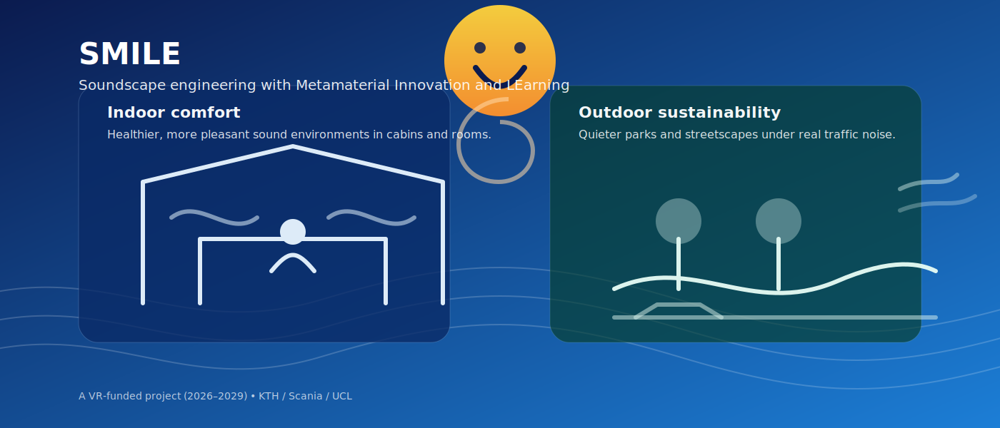

# SMILE

{ width="100%" }

**SMILE:** *Ljudlandskapsutformning med Metamaterialinnovation och Lärande*  
**KTH funding announcement:** [KTH news](https://www.kth.se/om/nyheter/centrala-nyheter/kth-forskare-far-155-miljoner-av-vetenskapsradet-1.1437168)

**SMILE-乐景工程**

**SMILE: Soundscape engineering with Metamaterial Innovation and LEarning** is a Swedish Research Council (VR) research project (2026–2029).

We develop an **integrated engineering framework** that combines:

- **Soundscape design** (human-centered design + perception)
- **Acoustic metamaterials** (advanced structures that manipulate sound waves)
- **Machine learning (ML)** for inverse design and optimization

The goal is to go beyond *decibel reduction* and instead enable **pleasant, healthy, and context-appropriate sound environments**.

## What we aim to deliver

- A **perceptually-driven inverse design loop** connecting acoustic simulation → ML optimization → human validation
- Novel metamaterial concepts for **broadband sound management**, including adaptive / topological approaches
- Open research outputs: **publications, software, datasets, and demonstrators**

## Why it matters

Environmental noise is traditionally treated as a pollutant. SMILE explores how sound can be managed as a **resource**—reducing harmful noise while shaping better soundscapes in vehicles and cities.

## Independent review highlights

From the VR review panel (Natural and Engineering Sciences, NT‑N):

> “This is a very strong application with only minor weaknesses… The goal is to go beyond simple noise reduction and instead engineer more pleasant and healthy soundscapes.”

> “The concept of a perceptually driven inverse design loop is highly original and presents significant practical challenges.”

*(Quoted from the final statement from the review panel for the application.)*
