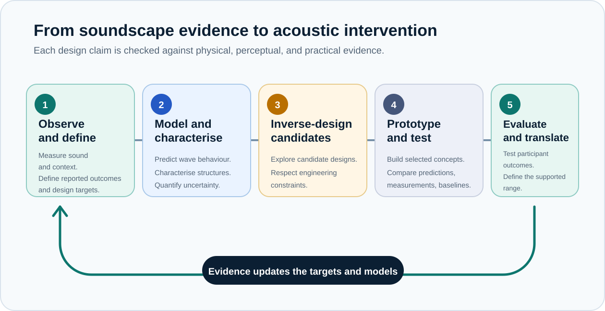

<section class="smile-hero" id="main-content" tabindex="-1">
  

    Swedish Research Council project · 2026–2029
    <h1>Engineering sound for people and place</h1>
    
SMILE investigates how soundscape evidence can become clear engineering targets for acoustic metamaterials—linking physics-based modelling, machine-learning-assisted inverse design, prototyping, and participant-based evaluation.

    

      <a class="button-primary" href="work-packages/">Explore the roadmap</a>
      <a class="button-secondary" href="about/">Read the research vision</a>
    

  

  

    
  

</section>

  
<strong>2026–2029</strong>Four-year research programme

  
<strong>SEK 3.5 million</strong>Swedish Research Council funding

  
<strong>2025-06253</strong>Grant reference

The research question

## How can perception inform acoustic engineering?

Sound level alone does not describe how an acoustic environment is perceived in context. At the same time, a desirable soundscape cannot be engineered without measurable physical targets, practical constraints, and evidence that an intervention performs as intended.

SMILE studies the bridge between these layers: **what people report**, **what an acoustic structure changes**, and **what can be built and tested reliably**.

  

    01
    <h3>Soundscape evidence</h3>
    
Define context-specific outcomes such as pleasantness, appropriateness, perceived comfort, and annoyance.

  

  

    02
    <h3>Physical acoustics</h3>
    
Model and measure how engineered structures affect transmission, reflection, absorption, spectrum, and directionality.

  

  

    03
    <h3>Learning-assisted design</h3>
    
Search a large design space while accounting for robustness, available space, mass, manufacturability, and sustainability.

  

One evidence loop

## Design, test, and learn

  

The workflow separates three questions that are sometimes conflated: **Does the device change the sound field?** **Do people report the intended effect in the tested context?** **Is the solution practical within the defined constraints?** A supported design decision needs evidence at all three levels.

  <strong>Project scope.</strong> SMILE develops and evaluates a perception-informed engineering workflow. It does not assume that a physically effective device will automatically improve experience; that relationship must be tested with participant-based studies.

From research to application

## Two illustrative pathways

  

    Indoor scenario
    <h3>Vehicle and room acoustics</h3>
    
Explore how compact acoustic structures could address constrained spaces while preserving context-appropriate sound and perceived comfort.

  

  

    Outdoor scenario
    <h3>Traffic-exposed public space</h3>
    
Explore how barriers or spatial elements could alter a sound field, then evaluate whether the change is perceptually meaningful in context.

  

These are **concept scenarios**, not claims of deployed interventions. The project roadmap moves from targets and benchmarks to candidate designs, prototypes, and bounded demonstrations.

<a href="metamaterials/">See how acoustic metamaterials enter the workflow →</a>

Latest public research

## Foundational work

  Related preprint
  <h3>The influence of visual context on truck cabin soundscape perception</h3>
  
Zibo Liu, Tin Oberman, Xiang Fang, Naveen Indolia, Francesco Aletta, Azra Habibovic, and Jian Kang.

  
<a href="https://doi.org/10.36227/techrxiv.176366537.73500767/v1">Read the TechRxiv preprint</a>

  
This study predates the SMILE grant and is presented as related foundational research.

Project identity

## SMILE at a glance

The official Swedish title is **SMILE: Ljudlandskapsutformning med Metamaterialinnovation och Lärande**. The public-facing English expansion is **Soundscape engineering with Metamaterial Innovation and LEarning**.

SMILE is funded by the **Swedish Research Council**, led by **Zibo Liu**, and administered by **KTH Royal Institute of Technology, Department of Engineering Mechanics**. Research collaboration connects expertise at KTH, University College London, and Scania.

<a href="funding/">Funding and collaboration details →</a>

