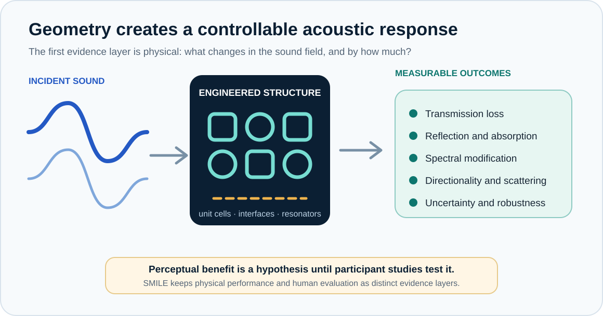

# Acoustic Metamaterials

Acoustic metamaterials are engineered structures whose geometry helps determine how they interact with sound. Their behaviour can differ from that of conventional homogeneous materials, creating new possibilities for controlling acoustic waves.

## Why are they interesting?

Depending on their design, acoustic metamaterials can influence transmission, reflection, absorption, or the direction of sound. They are especially interesting where conventional solutions are limited by size, weight, or the frequency range of interest.

## Their role in SMILE

SMILE studies acoustic metamaterials as one part of a broader soundscape-engineering vision. The project asks how physical acoustic design and human-centred evaluation can inform one another without assuming that a measured physical change automatically produces a preferred experience.

Detailed structures, optimisation methods, design parameters, and unpublished performance data are reserved for scientific outputs.

## Further reading

- Cummer, S. A., Christensen, J., and Alù, A. (2016). *Controlling sound with acoustic metamaterials.* **Nature Reviews Materials**, 1, 16001. [DOI](https://doi.org/10.1038/natrevmats.2016.1)
- Chaplain, G. J., Langfeldt, F., Romero-García, V., et al. (2025). *The 2024 acoustic metamaterials roadmap.* **Journal of Physics D: Applied Physics**, 58, 433001. [DOI](https://doi.org/10.1088/1361-6463/add306)
