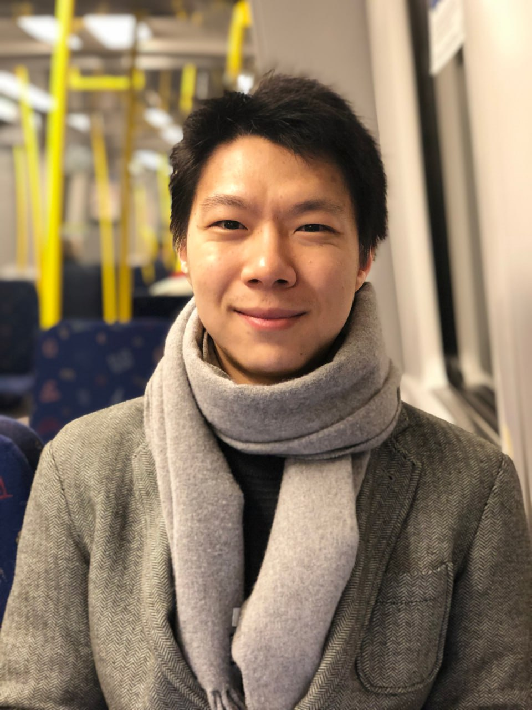

# Team

## Principal Investigator

{ width="220" style="border-radius: 999px;" }

- **Zibo Liu** — Project leader (KTH Royal Institute of Technology); also an engineer at Scania

## Participating researchers

- **Karl Bolin** — KTH
- **Jian Kang** — University College London (UCL)
- **Tin Oberman** — University College London (UCL)
- **Romain Rumpler** — KTH

*(Roles and short bios will be added once confirmed for the public website.)*
